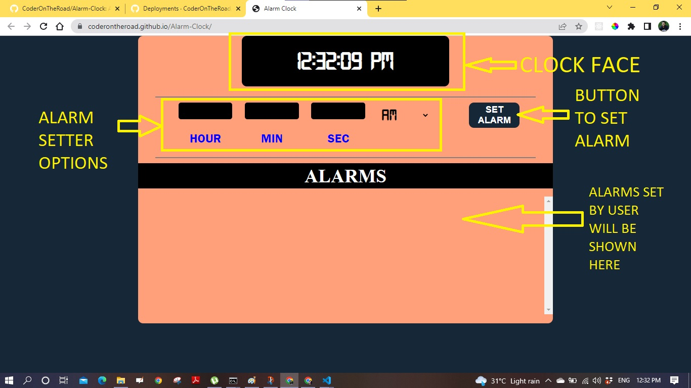
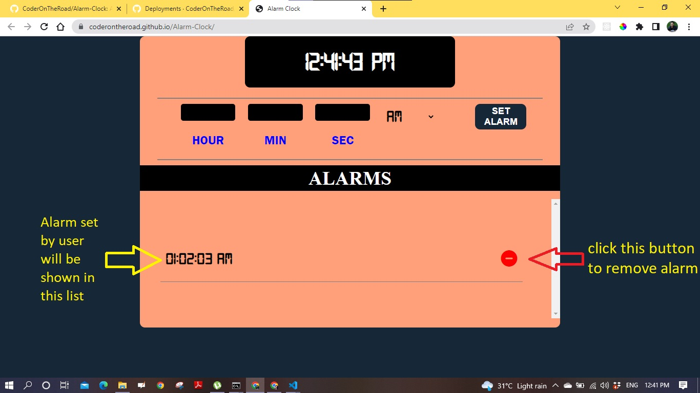

ALARM app 

# Alarm Clock
Set and delete Alarm.

## Tech Stack:
- HTML, CSS
- JavaScript

## Features
* Consists of Clock face, an input section to set alarm and set alarms list
* Click on the set Alarm button to set an alarm
Features 
* you must have to put some input in the hour field
* you cant set the same alarm two times
* if you dont put any input in minute and second input then it automatically takes 0 as input
* You an use the minus button in the alarms list to remove a perticular alarm

# Directory Structure

```
├── README.md
├── _config.yml       
├── fonts
│   ├── Technology.ttf
│   └── digital-7.ttf 
├── index.html        
├── script.js
└── style.css

```
## Features with details
<ol>
 <li><h3>Clock face and set alarm options</h3>
 <ul>
    <li>
    
    </li>
 </ul>
 </li>
  <li><h3>Delete or remove an alarm</h3>
 <ul>
    <li>
    
    </li>

 </ul>
 </li>

</ol>

  
## Git Clone
To use this repository in your local system-

<a href="https://github.com/CoderOnTheRoad/Alarm-Clock" target="_blank">https://github.com/CoderOnTheRoad/Alarm-Clock </a>

or run this command in your GitHub CLI

###### `gh repo clone CoderOnTheRoad/Alarm-Clock`
<br>


## <a href = "https://coderontheroad.github.io/Alarm-Clock/" target="_blank"> Demo / Hosted on - https://coderontheroad.github.io/Alarm-Clock/ </a>